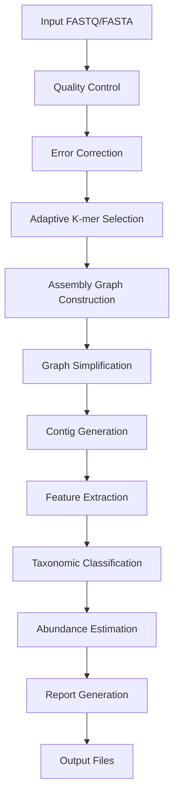

# MetaForge - Advanced Metagenomics Pipeline

[](https://www.rust-lang.org)
[](LICENSE)

A high-performance, AI-enhanced pipeline for metagenomic analysis built in Rust. MetaForge implements advanced algorithms for DNA sequence assembly, taxonomic classification, and abundance estimation using machine learning and graph neural networks.

## Features

- 🧬 **Adaptive K-mer Assembly** - Dynamic k-mer size selection based on sequence complexity
- 🤖 **AI-Enhanced Analysis** - Machine learning models for taxonomic classification and repeat resolution
- 📊 **Advanced Feature Extraction** - Comprehensive sequence and graph-based feature analysis
- 🚀 **High Performance** - Multi-threaded processing with memory-efficient streaming algorithms
- 🗄️ **Database Integration** - SQLite-based k-mer indexing and taxonomy management
- 📈 **Real-time Monitoring** - Built-in performance metrics and progress tracking
- 🔧 **Flexible Configuration** - TOML-based configuration with multiple preset templates

## Installation

### Prerequisites

- Rust 1.70 or later
- SQLite3
- OpenMP (for parallel processing)

### Build from Source

```bash
git clone https://github.com/mladen5000/meta-forge.git
cd meta-forge
cargo build --release
```

The compiled binary will be available at `target/release/meta-forge`.

### Install via Cargo

```bash
cargo install --path .
```

## Quick Start

### Basic Analysis Pipeline

Run a complete metagenomic analysis on a FASTQ file:

```bash
meta-forge analyze sample.fastq --sample-name "my_sample" --mode standard
```

### Generate Configuration Template

```bash
meta-forge config standard --output my_config.toml
```

## Usage Examples

### 1. Complete Analysis Pipeline

#### Standard Analysis Mode
Process a single FASTQ file with default settings:

```bash
meta-forge analyze reads.fastq \
  --sample-name "environmental_sample_1" \
  --mode standard \
  --output ./results \
  --threads 8
```

#### High-Performance Mode
For large datasets with optimized settings:

```bash
meta-forge analyze large_dataset.fastq \
  --sample-name "large_sample" \
  --mode high-performance \
  --config high_perf.toml \
  --memory 16 \
  --threads 16 \
  --output ./large_results
```

#### Low-Memory Mode
For resource-constrained environments:

```bash
meta-forge analyze reads.fastq \
  --sample-name "constrained_sample" \
  --mode low-memory \
  --config low_mem.toml \
  --memory 4 \
  --threads 4
```

#### Multiple Input Files
Process multiple FASTQ files in a single run:

```bash
meta-forge analyze reads_R1.fastq reads_R2.fastq \
  --sample-name "paired_sample" \
  --mode standard \
  --output ./paired_results
```

#### With Custom Configuration
Using a custom configuration file:

```bash
meta-forge analyze metagenome.fastq \
  --sample-name "custom_sample" \
  --config ./configs/custom.toml \
  --verbose
```

### 2. Assembly-Only Mode

#### Basic Assembly
Perform only sequence assembly without classification:

```bash
meta-forge assemble reads.fastq \
  --k-range 21-31 \
  --min-coverage 3 \
  --output ./assembly_results
```

#### Advanced Assembly Options
With custom parameters and graph simplification:

```bash
meta-forge assemble complex_reads.fastq \
  --k-range 15-35 \
  --k-step 4 \
  --min-coverage 5 \
  --min-length 500 \
  --simplify-graph \
  --remove-tips \
  --detect-bubbles \
  --output ./advanced_assembly
```

#### Multiple K-mer Sizes
Assembly with specific k-mer values:

```bash
meta-forge assemble reads.fastq \
  --k-values 21,25,29,33 \
  --adaptive-k \
  --output ./multi_k_assembly
```

### 3. Feature Extraction

#### Basic Feature Extraction
Extract sequence features from assembled contigs:

```bash
meta-forge features contigs.fasta \
  --types composition,complexity,patterns \
  --format json \
  --output features.json
```

#### Comprehensive Feature Analysis
Extract all available feature types:

```bash
meta-forge features sequences.fasta \
  --types composition,complexity,patterns,topology,motifs \
  --format csv \
  --k-mer-sizes 3,4,5,6 \
  --include-reverse-complement \
  --output comprehensive_features.csv
```

#### Graph-based Features
Extract features from assembly graphs:

```bash
meta-forge features assembly_graph.gfa \
  --types topology,connectivity \
  --format json \
  --graph-metrics \
  --output graph_features.json
```

### 4. Database Operations

#### Initialize Database
Create a new metagenomics database:

```bash
meta-forge database init ./data/metagenomics.db
```

#### Import Taxonomy Data
Load taxonomic classification data:

```bash
meta-forge database import-taxonomy ./data/metagenomics.db \
  --taxonomy-file ncbi_taxonomy.txt \
  --names-file names.dmp \
  --nodes-file nodes.dmp
```

#### Build K-mer Index
Create k-mer index for fast lookups:

```bash
meta-forge database build-index ./data/metagenomics.db \
  --k 21 \
  --input-fasta reference_genomes.fasta \
  --batch-size 10000
```

#### Query Database
Search for sequences in the database:

```bash
meta-forge database query ./data/metagenomics.db \
  --sequence ATCGATCGATCG \
  --k 21 \
  --output matches.json
```

### 5. Configuration Management

#### Generate Standard Configuration
Create a standard configuration template:

```bash
meta-forge config standard --output standard_config.toml
```

#### Generate High-Performance Configuration
For high-throughput analysis:

```bash
meta-forge config high-performance --output high_perf_config.toml
```

#### Generate Low-Memory Configuration
For resource-constrained environments:

```bash
meta-forge config low-memory --output low_mem_config.toml
```

#### Custom Configuration
Create a custom configuration with specific parameters:

```bash
meta-forge config custom \
  --k-range 19-33 \
  --threads 12 \
  --memory 8 \
  --output custom_config.toml
```

### 6. Testing and Benchmarks

#### Run All Tests
Execute the complete test suite:

```bash
meta-forge test all
```

#### Performance Benchmarks
Run performance benchmarks:

```bash
meta-forge test benchmark \
  --dataset-size large \
  --iterations 10 \
  --output benchmark_results.json
```

#### Integration Tests
Test with real datasets:

```bash
meta-forge test integration \
  --test-data ./test_datasets/ \
  --output integration_report.html
```

#### Memory Profiling
Profile memory usage during analysis:

```bash
meta-forge test memory-profile \
  --input test_reads.fastq \
  --output memory_profile.json
```

## Configuration File Examples

### Standard Configuration (`standard.toml`)

```toml
[general]
working_directory = "./data"
output_directory = "./results"
debug_mode = false
max_threads = 0  # Auto-detect

[assembly]
k_min = 21
k_max = 31
k_step = 2
min_coverage = 3
min_length = 200
graph_simplification = true

[features]
composition_features = true
complexity_features = true
topology_features = true
feature_dimensions = 100

[database]
connection_string = "sqlite:./data/metagenomics.db"
batch_size = 1000
index_k_size = 21

[ml]
model_path = "./models/"
use_gpu = false
batch_size = 32

[performance]
memory_limit_gb = 8
enable_monitoring = true
checkpoint_interval = 1000
```

### High-Performance Configuration (`high_perf.toml`)

```toml
[general]
working_directory = "./data"
output_directory = "./results"
debug_mode = false
max_threads = 0

[assembly]
k_min = 19
k_max = 35
k_step = 2
min_coverage = 2
min_length = 150
graph_simplification = true
parallel_assembly = true

[features]
composition_features = true
complexity_features = true
topology_features = true
motif_features = true
feature_dimensions = 200

[performance]
memory_limit_gb = 32
enable_monitoring = true
use_memory_mapping = true
aggressive_caching = true
```

## Pipeline Workflow



## Output Files

MetaForge generates several output files depending on the analysis mode:

- **Assembly Results**
  - `contigs.fasta` - Assembled contiguous sequences
  - `assembly_stats.json` - Assembly statistics and metrics
  - `assembly_graph.gfa` - Assembly graph in GFA format

- **Feature Analysis**
  - `features.json/csv` - Extracted sequence features
  - `feature_summary.html` - Interactive feature visualization

- **Classification Results**
  - `taxonomy.json` - Taxonomic assignments
  - `abundance_profile.csv` - Species abundance estimates
  - `classification_report.html` - Detailed classification results

- **Performance Metrics**
  - `performance.json` - Runtime and resource usage metrics
  - `memory_profile.json` - Memory usage over time

## Advanced Features

### Custom Machine Learning Models

Load custom ONNX models for taxonomic classification:

```bash
meta-forge analyze reads.fastq \
  --sample-name "custom_ml_sample" \
  --ml-model ./models/custom_classifier.onnx \
  --ml-config ./configs/ml_config.json
```

### Streaming Analysis

Process large files in streaming mode:

```bash
meta-forge analyze huge_dataset.fastq \
  --sample-name "streaming_sample" \
  --streaming-mode \
  --chunk-size 10000 \
  --memory 4
```

### Distributed Processing

Run analysis across multiple nodes:

```bash
meta-forge analyze dataset.fastq \
  --sample-name "distributed_sample" \
  --distributed \
  --node-config cluster_config.toml
```

## Troubleshooting

### Common Issues

1. **Out of Memory Errors**
   ```bash
   # Use low-memory mode
   meta-forge analyze reads.fastq --mode low-memory --memory 2
   ```

2. **Slow Performance**
   ```bash
   # Increase thread count and use high-performance mode
   meta-forge analyze reads.fastq --mode high-performance --threads 16
   ```

3. **Database Connection Issues**
   ```bash
   # Initialize database first
   meta-forge database init ./data/metagenomics.db
   ```

### Debug Mode

Enable verbose logging for troubleshooting:

```bash
meta-forge analyze reads.fastq --verbose --debug
```

### Performance Monitoring

Monitor resource usage during analysis:

```bash
RUST_LOG=debug meta-forge analyze reads.fastq --sample-name "monitored_sample"
```

## Contributing

We welcome contributions! Please see [CONTRIBUTING.md](CONTRIBUTING.md) for guidelines.

## License

This project is licensed under the MIT License - see the [LICENSE](LICENSE) file for details.

## Citation

If you use MetaForge in your research, please cite:

```bibtex
@software{metaforge,
  title = {MetaForge: Advanced Metagenomics Pipeline},
  author = {Mladen Rasic},
  year = {2024},
  url = {https://github.com/mladen5000/meta-forge}
}
```

## Support

- 📖 **Documentation**: [Full documentation](docs/)
- 🐛 **Issues**: [GitHub Issues](https://github.com/mladen5000/meta-forge/issues)
- 💬 **Discussions**: [GitHub Discussions](https://github.com/mladen5000/meta-forge/discussions)
- 📧 **Contact**: [youremail@example.com](mailto:youremail@example.com)