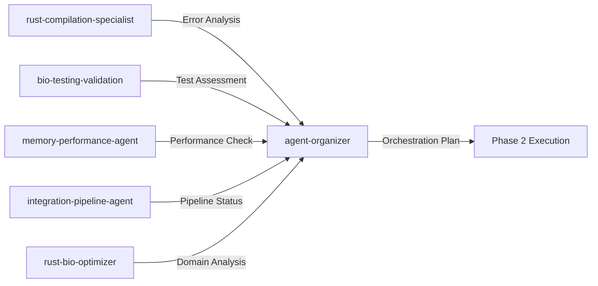

# Agent Orchestration Strategy
## Multi-Agent TDD Compilation Fix Coordination

### 🎯 Agent Organization Overview

This document outlines the specific agent team composition, role assignments, and coordination protocols for systematic compilation error resolution across the metagenomic assembly pipeline.

## 🤖 Agent Team Roster & Specializations

### Primary Specialist Agents

#### 1. **Rust-Bio-Optimizer Agent** (`rust-bio-optimizer`)
**Primary Role**: Bioinformatics-specific Rust optimization
**Specializations**:
- DNA sequence processing algorithms
- K-mer handling and canonical representation
- Memory-efficient bioinformatics data structures
- Performance optimization for genomic workloads

**Assigned Modules**: 
- `src/core/data_structures.rs` 
- `src/assembly/optimized_structures.rs`
- `src/features/extraction.rs`

**TDD Responsibilities**:
- Create performance benchmark tests
- Validate biological accuracy of optimizations
- Ensure memory reduction targets (70-85%) are maintained

---

#### 2. **Agent-Organizer** (`agent-organizer`) - **YOU**
**Primary Role**: Multi-agent coordination and task orchestration
**Specializations**:
- Team assembly and workflow design  
- Dependency mapping and critical path analysis
- Resource allocation and load balancing
- Progress monitoring and quality gates

**Coordination Responsibilities**:
- Real-time agent status monitoring
- Dependency conflict resolution
- Quality gate enforcement
- Escalation path management

---

#### 3. **Bio-Testing-Validation Agent** (`bio-testing-validation`)
**Primary Role**: Bioinformatics testing and validation
**Specializations**:
- Domain-specific test case design
- Biological correctness validation
- Integration test orchestration
- Regression detection

**Assigned Focus**:
- All test files in `tests/` directory
- Validation of assembly pipeline accuracy
- Performance regression prevention
- End-to-end integration testing

---

#### 4. **Rust-Compilation-Specialist Agent** (`rust-compilation-specialist`)
**Primary Role**: Core Rust compilation error resolution
**Specializations**:
- Complex lifetime annotation issues
- Trait implementation and derivation
- Module system and import resolution
- Type system error resolution

**Assigned Modules**:
- `src/lib.rs` and module structure
- Cross-module dependency issues
- Trait implementation completeness
- Generic type parameter resolution

---

#### 5. **Memory-Performance-Agent** (`memory-performance-agent`)
**Primary Role**: Memory optimization and performance validation
**Specializations**:
- Memory leak detection and prevention
- Performance benchmark maintenance
- Cache efficiency optimization
- Concurrent processing optimization

**Focus Areas**:
- `src/assembly/optimized_structures.rs` validation
- Memory pool implementations
- Parallel processing correctness
- Performance regression detection

---

#### 6. **Integration-Pipeline-Agent** (`integration-pipeline-agent`)
**Primary Role**: Pipeline integration and end-to-end functionality
**Specializations**:
- Pipeline orchestration fixes
- Database integration issues
- TUI/interface compilation
- Complete workflow validation

**Assigned Modules**:
- `src/pipeline/` complete module
- `src/database/` integration issues
- `src/tui/` compilation fixes
- Binary compilation (`src/bin/` files)

## 🔄 Agent Coordination Workflow

### Phase 1: Diagnostic & Assessment (Parallel)
**Duration**: 30 minutes
**Agents Active**: All 6 agents



**Concurrent Execution**:
```bash
# All agents execute diagnostics in parallel
parallel --jobs 6 <<EOF
rust-compilation-specialist --analyze-core-errors
bio-testing-validation --assess-test-coverage  
memory-performance-agent --benchmark-current-state
integration-pipeline-agent --validate-pipeline-integrity
rust-bio-optimizer --analyze-bio-performance
agent-organizer --coordinate-diagnostic-results
EOF
```

### Phase 2: TDD Test Creation (Sequential Coordination)
**Duration**: 20 minutes
**Lead Agent**: `bio-testing-validation`
**Support**: All agents contribute domain-specific tests

**Test Creation Priority**:
1. **Core compilation tests** (rust-compilation-specialist)
2. **Bioinformatics accuracy tests** (rust-bio-optimizer) 
3. **Memory optimization tests** (memory-performance-agent)
4. **Integration pipeline tests** (integration-pipeline-agent)
5. **Cross-module dependency tests** (agent-organizer coordinates)

### Phase 3: Parallel Fix Implementation
**Duration**: 2-3 hours
**Mode**: Full parallel execution with coordination checkpoints

#### Team Alpha: Core Infrastructure
**Lead Agent**: `rust-compilation-specialist`
**Support Agent**: `agent-organizer` (coordination)
**Target**: Core compilation errors and trait implementations

#### Team Beta: Bioinformatics Optimization  
**Lead Agent**: `rust-bio-optimizer`
**Support Agent**: `memory-performance-agent`
**Target**: Domain-specific optimizations and biological correctness

#### Team Gamma: Testing & Validation
**Lead Agent**: `bio-testing-validation`  
**Support Agent**: `agent-organizer` (quality gates)
**Target**: All test compilation and validation infrastructure

#### Team Delta: Integration & Pipeline
**Lead Agent**: `integration-pipeline-agent`
**Support Agent**: `memory-performance-agent`
**Target**: End-to-end pipeline functionality

### Coordination Checkpoints

#### Every 30 minutes:
```bash
# Status synchronization
agent-organizer --collect-status-reports
agent-organizer --identify-blocking-dependencies  
agent-organizer --reallocate-resources-if-needed
```

#### Critical Decision Points:
1. **Module dependency conflicts** → Escalate to agent-organizer
2. **Performance regression detected** → memory-performance-agent takes lead
3. **Biological accuracy concerns** → rust-bio-optimizer takes lead
4. **Test infrastructure failures** → bio-testing-validation takes lead

## 🚨 Escalation & Risk Management

### Risk Categories & Response Teams

#### High-Risk Scenario 1: Core Data Structure Changes Required
**Trigger**: Fundamental changes needed in `src/core/data_structures.rs`
**Response Team**: 
- **Lead**: rust-compilation-specialist
- **Support**: rust-bio-optimizer (domain validation)
- **Coordinator**: agent-organizer
- **Validator**: bio-testing-validation

**Protocol**:
1. rust-compilation-specialist implements minimal fix
2. rust-bio-optimizer validates biological correctness
3. bio-testing-validation runs comprehensive test suite
4. agent-organizer approves or escalates

#### High-Risk Scenario 2: Memory Optimization Breaks Functionality
**Trigger**: Performance optimizations cause compilation failures
**Response Team**:
- **Lead**: memory-performance-agent  
- **Support**: rust-bio-optimizer
- **Coordinator**: agent-organizer
- **Validator**: integration-pipeline-agent

**Protocol**:
1. Immediate rollback to working state
2. memory-performance-agent redesigns approach
3. Incremental re-implementation with testing
4. integration-pipeline-agent validates end-to-end functionality

#### High-Risk Scenario 3: Circular Dependency Deadlock
**Trigger**: Cross-module fixes create circular dependencies
**Response Team**:
- **Lead**: agent-organizer
- **Support**: All agents (dependency analysis)
- **Implementer**: rust-compilation-specialist
- **Validator**: bio-testing-validation

**Protocol**:
1. agent-organizer maps full dependency graph
2. Identifies minimum viable dependency break points
3. rust-compilation-specialist implements architecture changes
4. All agents validate their modules independently

## 📊 Success Metrics & Quality Gates

### Individual Agent Success Criteria

#### rust-compilation-specialist:
- [ ] Zero compilation errors in assigned modules
- [ ] All trait implementations complete
- [ ] Module imports resolve correctly
- [ ] Generic type parameters properly constrained

#### rust-bio-optimizer:
- [ ] Bioinformatics accuracy maintained (>99.9%)
- [ ] Memory optimization targets achieved (70-85% reduction)
- [ ] K-mer processing performance maintained
- [ ] Canonical representation correctness verified

#### bio-testing-validation:
- [ ] 100% test compilation success
- [ ] Integration test suite passes
- [ ] Regression test coverage >95%
- [ ] Performance benchmarks within tolerance

#### memory-performance-agent:
- [ ] No memory leaks detected
- [ ] Performance benchmarks pass
- [ ] Memory optimization targets achieved
- [ ] Concurrent processing correctness verified

#### integration-pipeline-agent:
- [ ] End-to-end pipeline compilation success
- [ ] All binary targets compile
- [ ] Database integration functional
- [ ] TUI interface operational

#### agent-organizer (YOU):
- [ ] All agent teams report success
- [ ] Quality gates passed
- [ ] No blocking dependencies remaining
- [ ] Coordination overhead <10% of total time

### Team Success Metrics
- **Overall compilation success**: 100%
- **Clippy compliance**: Zero warnings
- **Test pass rate**: 100%  
- **Performance maintenance**: <5% regression
- **Memory optimization**: 70-85% reduction achieved
- **Biological accuracy**: >99.9% maintained

## 🔄 Communication Protocol

### Real-time Status Updates
**Frequency**: Every 15 minutes
**Channel**: Shared status dashboard
**Format**:
```json
{
  "agent": "rust-bio-optimizer",
  "status": "in_progress", 
  "completion": "65%",
  "current_task": "fixing CompactKmer trait implementations",
  "blocking_issues": [],
  "estimated_completion": "45 minutes"
}
```

### Dependency Coordination
**Trigger**: Agent identifies blocking dependency
**Process**:
1. Agent reports dependency via immediate alert
2. agent-organizer analyzes impact and alternatives  
3. Affected agents coordinate resolution strategy
4. Implementation proceeds with updated priorities

### Quality Gate Reviews
**Frequency**: End of each major phase
**Participants**: All agents
**Process**:
1. Each agent reports module-level success
2. Cross-agent integration testing
3. Performance and accuracy validation
4. Go/no-go decision for next phase

This orchestration strategy ensures efficient, coordinated resolution of all compilation errors while maintaining the highest standards of code quality and bioinformatics accuracy.